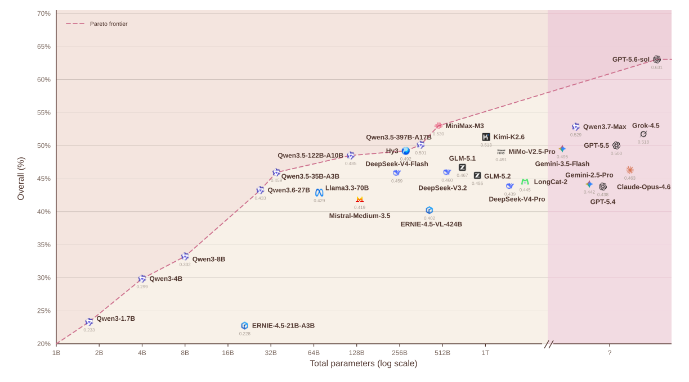
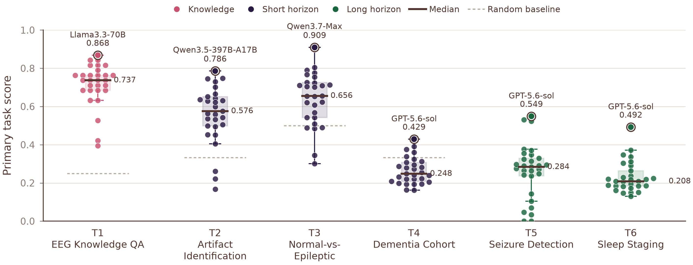

# EEGAgentBench

**Benchmarking LLM Agents on Short- and Long-Horizon EEG Analysis**

🌐 [Project Page](https://528why.github.io/EEGAgentBench-Page/) &nbsp;•&nbsp; 📄 [Paper](https://arxiv.org/pdf/2609.31632) &nbsp;•&nbsp; 🤗 [Dataset](https://huggingface.co/datasets/whhhy123/EEGAgentBenchmark) &nbsp;•&nbsp; 💻 [Code](https://github.com/528why/EEGAgentBenchmark)

EEGAgentBench is a unified benchmark for evaluating general-purpose LLM agents
on tool-based EEG analysis. EEG analysis is evolving from short-segment
classification toward long-horizon interpretation that demands iterative
evidence accumulation, multi-step reasoning, and the coordinated use of
specialized signal-processing tools. EEGAgentBench is designed to evaluate these
abilities: it pairs **1,072 evaluation instances** drawn from six public
datasets with a shared toolbox of **10 deterministic EEG analysis tools**, and
asks agents to select tools autonomously, gather evidence step by step, and
build their own analysis workflows rather than follow a fixed pipeline.

The benchmark spans six representative EEG applications, signal durations from
**2 seconds to nearly 23 hours**, and prediction targets ranging from class
labels to event intervals and epoch-level sequences. In the accompanying paper
we evaluate **29 frontier LLMs from 15 model families**. Results show that
EEGAgentBench distinguishes agent capabilities beyond model scale and inference
cost, and that current agents still struggle on long-horizon tasks that demand
sustained evidence accumulation and multi-step reasoning.

This repository contains the runtime, tasks, tools, evaluators, official
metrics, public scenarios, and answer keys. The ~23 GB of frozen EEG/PSG
signals are distributed separately on the
[Hugging Face dataset](https://huggingface.co/datasets/whhhy123/EEGAgentBenchmark).

<p align="center">
  
</p>
<p align="center"><em>Per-task performance versus model scale across 29 LLM agents — performance is not determined by parameter count alone.</em></p>

## Tasks

| | Task | Source | Instances | Input | Output | Primary metric |
|---|---|---|---:|---|---|---|
| Knowledge | **T1** EEG Knowledge QA | MedMCQA-EEG-strict | 38 | No signal | Single label (A/B/C/D) | Accuracy |
| Short-horizon | **T2** Artifact Identification | EEGdenoiseNet | 300 | 2 s, 1 channel | clean / ocular / muscle | Macro-F1 |
| Short-horizon | **T3** Normal-vs-Epileptic Screening | Bonn | 188 | 23.6 s, 1 channel | normal / epileptic | Macro-F1 |
| Short-horizon | **T4** Dementia Cohort Classification | OpenNeuro ds004504 | 69 | 5.1–21.5 min, 19 ch | AD / FTD / HC | Macro-F1 |
| Long-horizon | **T5** Seizure Event Detection | CHB-MIT | 280 | 12.4 min–4.0 h, 18–32 EEG ch | Event interval list | SzCORE-style Event-F1 |
| Long-horizon | **T6** Sleep Staging | Sleep-EDFx | 197 | 5.7–23.0 h, 5–7 PSG ch | 30-s epoch-label sequence | Macro-F1 |

T4 is a **research** cohort-classification task, not a clinical diagnosis task.
The **Overall** score is the equally weighted mean of T1 accuracy, Macro-F1 for
T2–T4 and T6, and SzCORE-style Event-F1 for T5. The paper also reports secondary
metrics — Accuracy for T2–T4, Dice-S for T5, and Cohen's κ for T6.

## The Toolbox

For T2–T6 every agent shares the same 10 deterministic, non-parametric tools,
which expose only task-relevant measurements:

- **Recording metadata** — sampling rate, duration, channel names and types.
- **Signal-quality assessment** — RMS amplitude, flat-line ratio, extrema
  repetition, power-line noise, high-frequency noise.
- **Frequency- and time-domain analysis** — power spectrum, band power, Hjorth
  parameters, line length, zero-crossing rate.
- **Windowed feature extraction** for temporal analysis.
- **Transient candidate detection** — time, amplitude, width, and steepness.
- **Cross-channel analysis** — left–right asymmetry and inter-channel
  correlation.

Agents choose which tools to call, in what order, and when to stop; tool
selection and intermediate observations never contribute directly to the score.

## Selected Results

Top three models by Overall score (see the paper for the full leaderboard of 29
models and per-task breakdowns):

| Rank | Model | Overall |
|---|---|---:|
| 🥇 | GPT-5.6-sol | **0.631** |
| 🥈 | MiniMax-M3 | 0.530 |
| 🥉 | Qwen3.7-Max | 0.529 |

No single model dominates every task: T1–T3 are led by Llama3.3-70B,
Qwen3.5-397B-A17B, and Qwen3.7-Max, respectively, while GPT-5.6-sol leads T4–T6.
Dementia cohort classification (T4) and full-night sleep staging (T6) remain
shared bottlenecks across the evaluated models.

<p align="center">
  
</p>
<p align="center"><em>Task-level score distributions across 29 models. T2/T3 spread widely and separate short-horizon skill; T4 and T6 stay low as shared bottlenecks.</em></p>

## Install

```bash
python -m venv .venv
. .venv/bin/activate
pip install -e .
```

## Get the Signals

The code archive does not include the ~23 GB of frozen signals. Download them
from the Hugging Face dataset into the repository root, then verify:

```bash
pip install -U huggingface_hub
hf download whhhy123/EEGAgentBenchmark data/ metadata/ \
  --repo-type dataset --local-dir .
eeg-bench prepare                           # verify paths and file sizes
python scripts/validate_release.py          # verify the frozen release layout
```

The signals keep their source-specific terms; see `data/README.md` and the
dataset card before reuse.

## Configure a Model

Copy `configs/agents/openai_compatible.yaml`, set `model` and `base_url`, and
export the key named by `api_key_env` (secrets must not be written into YAML):

```bash
export OPENAI_API_KEY=your-key
```

Both OpenAI-compatible native function calling and a provider-independent text
action protocol are supported by the runtime adapter.

## Run & Score

```bash
# one task
eeg-bench run \
  --scenario benchmark/scenarios/T3.jsonl \
  --agent configs/agents/openai_compatible.yaml \
  --output outputs/T3

# the full benchmark (T1–T6); re-invoke with the same name to resume
eeg-bench run-all \
  --agent configs/agents/openai_compatible.yaml \
  --run-name my-model
```

Each run writes `runs.jsonl`, `trajectories/`, `run_status.json`, and an
official `summary.json`; `run-all` also produces
`outputs/my-model/benchmark_summary.json`. **Official scores are always
recomputed from predictions and the separate answer key** — cached scalar
scores are ignored — so results stay reproducible and comparable. To re-score
existing predictions, run `eeg-bench summarize --scenario ... --runs ...`.

See `METRICS.md` for the official metric definitions and malformed-output
handling. Contributors can run the test suite with
`pip install -e '.[dev]' && pytest`.

## Data Sources and Terms

EEGAgentBench builds on six public datasets: MedMCQA (T1), EEGdenoiseNet (T2),
Bonn (T3), OpenNeuro ds004504 (T4), CHB-MIT (T5), and Sleep-EDFx (T6). Each
dataset retains its own upstream license and attribution requirements — in
particular, the Bonn source states that its code, data, and results may be used
free of charge for research and education, and that commercial and military use
is prohibited; please verify the current terms on the official Bonn page before
reuse. Please review and cite the original sources; see the dataset card and
`LICENSES/README.md` in the Hugging Face release for details. This benchmark is a research tool and must not be used
for diagnosis, patient care, or treatment decisions.

## Citation

If you find EEGAgentBench useful, please cite (the entry will be updated with
the arXiv identifier once available):

```bibtex
@misc{wu2026eegagentbench,
  title  = {EEGAgentBench: Benchmarking LLM Agents on Short- and Long-Horizon EEG Analysis},
  author = {Wu, Huyu and Weng, Weining and Liu, Yuchen and Gu, Yang},
  year   = {2026}
}
```

The code is released under the Apache-2.0 License (see `LICENSE`). Dataset files
remain under their respective upstream terms.
